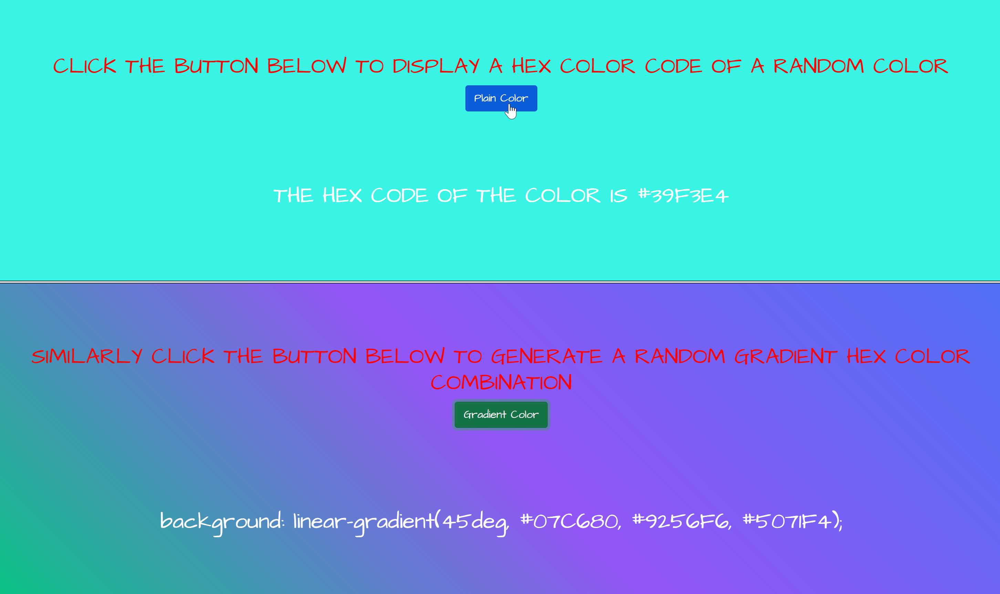

# RandomHexCodeColorGradientSelector

###As someone who loves to experiment with various combinations of colors I've created a easy bookmark'able project that allows frontend enthusiasts looking to experiment with background colors and gradient shades to click until they find a color scheme that suits their taste. 

📄 [Github Page](https://dionnenoellabarretto.github.io/RandomHexCodeColorGradientSelector/)
🗂️ [Github Repository](https://github.com/DionneNoellaBarretto/RandomHexCodeColorGradientSelector)

This application is built using HTML, CSS, JavaScript & Bootstrap.

**Example Screenshot:**

